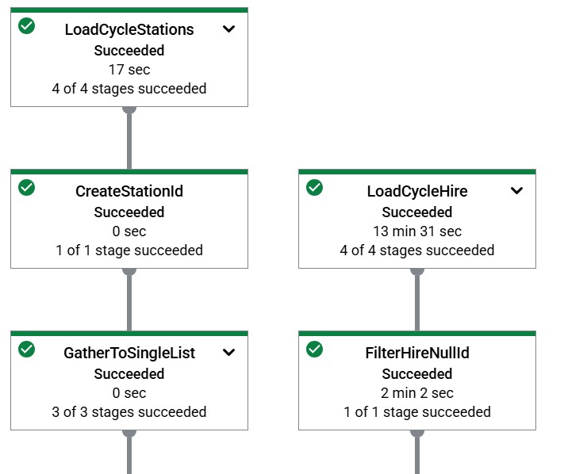
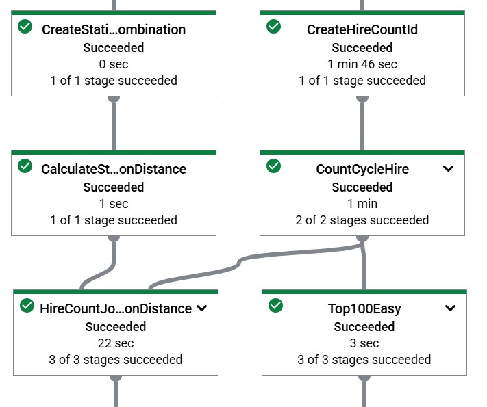
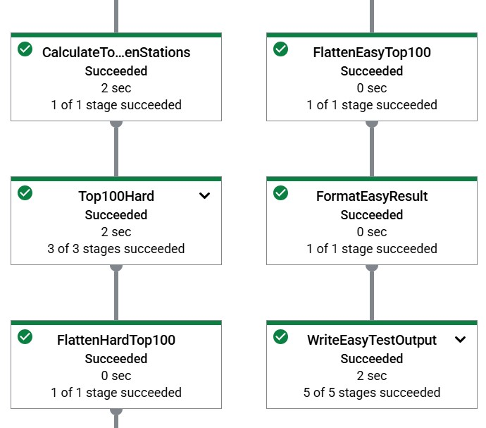
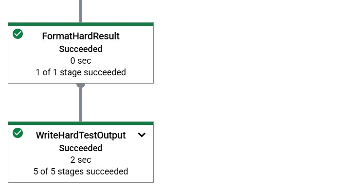

# Apache Beam Dataflow Demo
*Updated: 2025/07/07, NerdIsMe*
## Goal
Given the public dataset of [London Bicycle Hires](https://console.cloud.google.com/marketplace/details/greater-london-authority/london-bicycles?filter=solution-type:dataset&;id=95374cac-2834-4fa2-a71f-fc033ccb5ce4&hl=zh-tw&inv=1&invt=Ab2H1w&project=ml6-code-test-464510) the goal of this project is to:
- Easy Test: calculate the number of bike rides from **every start station to every end station**, and retained the **top 100 most frequent routes**.
- Hard Test: compute the **total distance** of each route by multiplying the number of rides with the **direct distance** between stations (using latitude and longitude), and retain the **top 100 longest total-distance routes**.

All data processing and aggregations must be performed using **Apache Beam**, with the pipeline executed on **Google Cloud Dataflow**. Only **SELECT queries** are allowed when reading from the public dataset — all filtering, grouping, and transformation logic must be implemented in Beam.

## Data
The [London Bicycle Hires](https://console.cloud.google.com/marketplace/details/greater-london-authority/london-bicycles?filter=solution-type:dataset&;id=95374cac-2834-4fa2-a71f-fc033ccb5ce4&hl=zh-tw&inv=1&invt=Ab2H1w&project=ml6-code-test-464510) dataset is a public dataset available on Google Cloud BigQuery. It consists of two tables:
- `cycle_hire`: contains detailed records of each bike rental, with approximately **83 million rows**.
- `cycle_station`: the information of each cycle station, with **800 stations**.
## Instruction
### Files
- `./my_pipeline/`: contains the Apache Beam pipeline code, including `main.py` as the entry point.
- `./results/`: contains the result of easy and hard test.
- `./requirements.txt`: Lists the required Python packages to set up the environment.
- `./run.sh`: Bash script to execute the Beam pipeline with appropriate parameters.
- `./setup.py`: Configuration script for packaging the pipeline for GCP Dataflow execution.

### Pipeline Graph on Dataflow





### Pipeline Simple Logics 
```
[ReadFromBigQuery] 
     ↓
[CalculateStationDistances]
     ↓
[CountRideCountFromHire] → [Top100ByCount]
     ↓
[CalculateRideDistance]
     ↓
[Top100ByDistance]
```
#### ReadFromBigQuery
Read the public dataset tables from BigQuery:
- cycle_station: station metadata including latitude and longitude.
- cycle_hire: all bike rental records (start station, end station, rental id).

Only simple SELECT queries are used here to fetch raw data.

####  CalculateStationDistances
Compute the direct (great-circle) distance between each pair of stations using their latitude and longitude coordinates. This results in a mapping of (start_station_id, end_station_id) → distance_km.

####  CountRideCountFromHire
Group rental records by (start_station_id, end_station_id) and count the total number of rides between each station pair.

####  Top100ByCount
Extract the top 100 most frequent routes (highest ride counts), each row is formatted as:
`start_station_id,end_station_id,count`

####  CalculateRideDistance
Multiply the ride counts by the direct distances to compute the total distance traveled per route.

####  Top100ByDistance
Extract the top 100 routes by total traveled distance, ach row is formatted as:
`start_station_id,end_station_id,count,total_travel_distance`

## Results
- The Apache Beam pipeline completed the entire computation on GCP Dataflow in approximately **13 minutes**.
- Successfully calculated the top 100 most frequent bike routes and the top 100 routes with the longest total traveled distance.
- Results are available for further analysis or visualization.